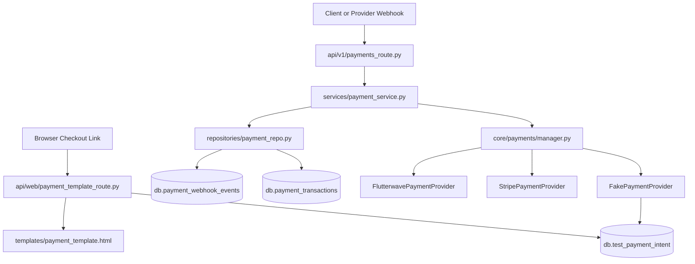
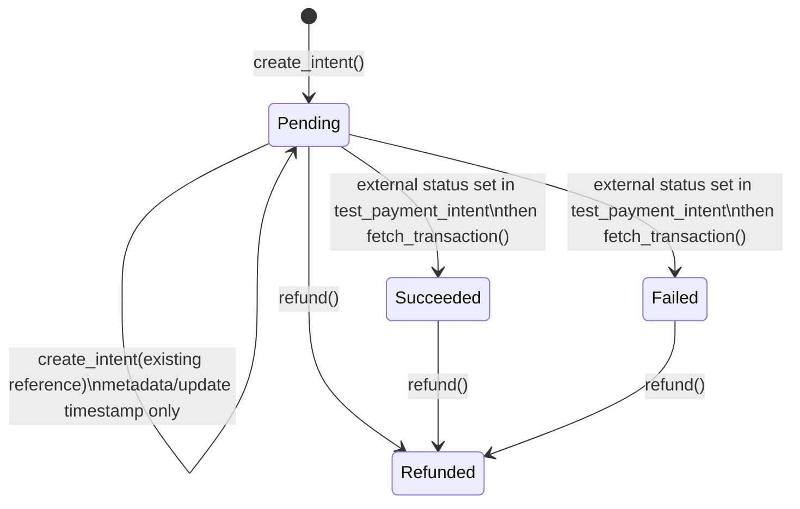
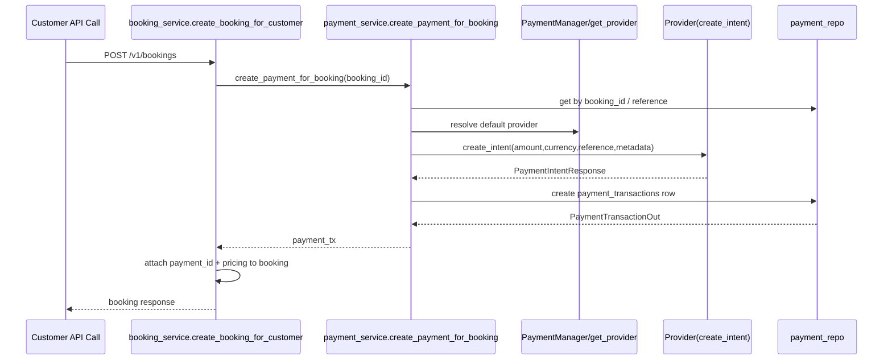
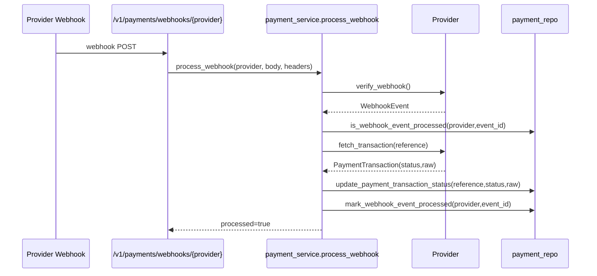
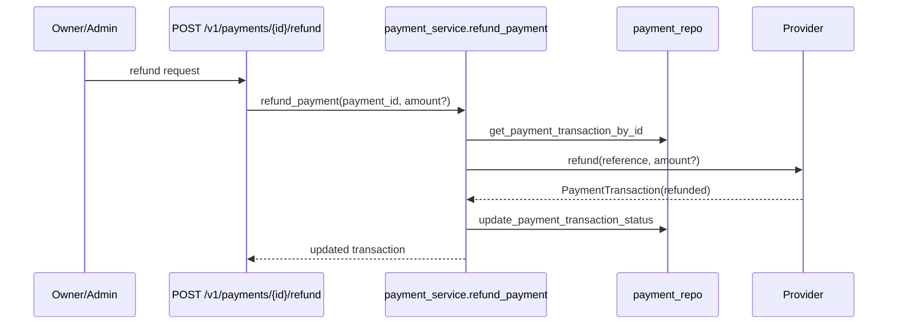

# Payment Core Service Template and Migration Guide

This document explains the payment architecture in this repository end-to-end, including runtime behavior, contracts, flow control, persistence, and migration guidance.

The most detailed section is `FakePaymentProvider` because it is the local template provider and the intended migration reference.

## 1) Architecture Overview

Payment behavior is split across five layers:

1. API routes
2. Service orchestration
3. Provider abstraction and concrete providers
4. Persistence repositories
5. Web checkout template route for test/provider link rendering

Primary files:

- `core/payments/provider.py`
- `core/payments/types.py`
- `core/payments/manager.py`
- `core/payments/test_environment_provider.py`
- `core/payments/stripe_provider.py`
- `core/payments/flutterwave_provider.py`
- `services/payment_service.py`
- `repositories/payment_repo.py`
- `schemas/payment_schema.py`
- `api/v1/payments_route.py`
- `api/web/payment_template_route.py`
- `templates/payment_template.html`
- `static/payment-template.css`
- `static/payment-template.js`
- `services/booking_service.py`
- `api/v1/booking_route.py`
- `core/settings.py`
- `main.py`

High-level interaction:

## 2) Core Contracts

### 2.1 Provider protocol

`core/payments/provider.py` defines `PaymentProvider` as a `Protocol` with required async methods:

- `create_intent(payload: PaymentIntentRequest) -> PaymentIntentResponse`
- `verify_webhook(body: bytes, headers: dict[str, str]) -> WebhookEvent`
- `fetch_transaction(reference: str) -> PaymentTransaction`
- `refund(reference: str, amount_minor: int | None = None) -> PaymentTransaction`

Any custom provider must satisfy these methods.

### 2.2 Shared payment types

`core/payments/types.py` defines:

- `PaymentProviderName`: `stripe`, `flutterwave`, `test`
- `PaymentStatus`: `pending`, `succeeded`, `failed`, `refunded`
- `PaymentIntentRequest`
- `PaymentIntentResponse`
- `WebhookEvent`
- `PaymentTransaction`

These dataclasses are the internal provider-service interface.

### 2.3 API/Persistence schemas

`schemas/payment_schema.py` defines:

- `PaymentIntentIn`
- `RefundIn`
- `PaymentTransactionCreate`
- `PaymentTransactionOut`
- `WebhookReplayCreate`

Note: `PaymentIntentIn` exists in schema and service, but there is currently no route exposing payment-intent creation directly.

## 3) Provider Bootstrapping and Selection

`core/payments/manager.py` controls provider registration and default selection.

Registration rules from settings:

- Register Flutterwave if `flutterwave_secret_key` exists.
- Register Stripe if `stripe_secret_key` exists.
- Register Fake/Test if `test_payment_base_url` exists.

If no providers are registered, startup errors with:

- `At least one payment provider must be configured...`

Default provider:

- Start with `settings.payment_default_provider`.
- If it is not present in registered providers, fallback to first registered provider.

Resolution:

- `get_provider(provider)` lowercases input and resolves by key.
- Unknown key raises `ValueError("Unsupported payment provider ...")`.

Operational implication:

- This `ValueError` is not normalized in payment service; route-level behavior can become a 500 envelope from global exception handling.

## 4) Service Layer Orchestration

`services/payment_service.py` is the payment application service.

### 4.1 `create_payment_intent(...)`

Behavior:

1. Resolve provider from `payload.provider` or default provider.
2. Check existing transaction by `reference`.
3. If found, return existing transaction (idempotent by reference at service level).
4. Else call provider `create_intent`.
5. Persist new row in `payment_transactions`.

Stored fields include:

- `owner_id`
- optional `booking_id` from metadata
- `provider`
- `reference`
- `status`
- `amount_minor`
- `currency`
- `response_payload`
- `idempotency_key = "{provider}:{reference}"`
- timestamps

Important: there is no public route currently calling this function.

### 4.2 `create_payment_for_booking(...)`

Behavior:

1. Return existing transaction if `booking_id` already mapped.
2. Load booking; 404 if not found.
3. Calculate quote.
4. Retrieve customer email.
5. Build canonical reference: `booking-{booking_id}`.
6. Return existing by reference if present.
7. Create provider intent with enriched metadata.
8. Persist transaction row.

This is invoked by `services/booking_service.py` during booking creation.

### 4.3 `process_webhook(...)`

Behavior:

1. Resolve provider by route path value.
2. Provider verifies webhook and returns normalized `WebhookEvent`.
3. Check replay table by `(provider_name_from_path, event_id)`.
4. Extract reference from payload:
   - `payload.data.tx_ref`
   - `payload.data.reference`
   - `payload.reference`
5. Fetch provider transaction by reference.
6. Update `payment_transactions.status` and `response_payload`.
7. Insert replay record.
8. Return processed summary.

Replay protection note:

- Replay check and replay insert are two separate operations, so concurrent duplicate deliveries can still race until the unique DB index rejects a duplicate insert.

Reference extraction note:

- Top-level `tx_ref` is not checked. Payloads that only include top-level `tx_ref` fail with "Webhook missing reference".

### 4.4 `refund_payment(...)`

Behavior:

1. Load payment by `payment_id`.
2. Resolve provider from stored transaction provider key.
3. Call provider `refund(...)`.
4. Update stored payment status/payload.

## 5) Persistence and Indexes

`repositories/payment_repo.py` creates indexes lazily on first call:

- `payment_transactions.reference` unique
- `payment_transactions.booking_id` unique sparse
- `payment_transactions.owner_id` non-unique
- `payment_webhook_events(provider, event_id)` unique

Repository operations:

- create/get by reference/get by booking/get by id/update status
- webhook replay lookup/insert

Current update behavior:

- `update_payment_transaction_status(...)` updates `status` and `response_payload` only.
- `updated_at` is not updated there.

## 6) API Routes (`api/v1/payments_route.py`)

Routes:

- `POST /v1/payments/webhooks/{provider}`
- `GET /v1/payments/{payment_id}`
- `GET /v1/payments/reference/{reference}`
- `POST /v1/payments/{payment_id}/refund`

Auth:

- Webhook endpoint has no token auth.
- Fetch/refund endpoints require `verify_any_token`.
- Owner or admin access is enforced for fetch/refund.

Docstring accepts providers:

- `stripe`, `flutterwave`, `test`

Path validation:

- Provider is currently not enum-validated in route declaration.
- Unsupported provider reaches manager and can result in 500 error envelope.

## 7) Booking Integration

`services/booking_service.py` integrates payment in booking creation and acceptance control.

During booking creation (`create_booking_for_customer`):

1. Creates booking row.
2. Calls `create_payment_for_booking`.
3. Calculates quote.
4. Writes `payment_id` + pricing fields to booking.
5. On payment creation failure, deletes booking (compensation behavior).

During cleaner acceptance (`accept_booking`):

- If `allow_pending_payment` is false:
  - booking must have `payment_id`
  - payment status must be `succeeded`

`api/v1/booking_route.py` sets `allow_pending_payment` from:

- `BOOKING_ALLOW_ACCEPT_ON_PENDING_PAYMENT`

## 8) FakePaymentProvider Deep Dive (Primary Reference)

File: `core/payments/test_environment_provider.py`

Class: `FakePaymentProvider`

Provider identity:

- `provider_name = "test"` (`PaymentProviderName.TEST.value`)

Storage:

- Reads/writes `db.test_payment_intent` directly.

### 8.1 Constructor and internal fields

Constructor:

- `base_url: str`
- `webhook_secret_hash: str | None = None`

Internal normalization:

- `self._base_url = base_url.rstrip("/")`
- `self._webhook_secret_hash = webhook_secret_hash`

This prevents double slash in checkout link construction.

Timestamp helper:

- Local helper `_epoch()` returns `int(time.time())` and is used for `created_at` and `updated_at`.

### 8.2 Status normalization

Method: `_normalize_status(raw_status)`

Mappings:

- `"success"`, `"successful"`, `"succeeded"` -> `PaymentStatus.SUCCEEDED`
- `"failed"` -> `PaymentStatus.FAILED`
- `"refunded"` -> `PaymentStatus.REFUNDED`
- anything else -> `PaymentStatus.PENDING`

### 8.3 Checkout URL

Method: `_build_checkout_url(reference)`

Output format:

- `"{base_url}/web/payments/link/{reference}"`

This links directly to `api/web/payment_template_route.py` dynamic route.

### 8.4 Internal record lookup

Method: `_find_intent(reference)`

Behavior:

- Query `db.test_payment_intent.find_one({"reference": reference})`
- If missing: `resource_not_found("TestPaymentIntent", reference)` (404)

### 8.5 `create_intent(...)` exact behavior

Input:

- `PaymentIntentRequest`

Document prepared for DB insert:

- `reference`
- `amount_minor`
- `currency` uppercased
- `customer_email`
- `metadata` default `{}`
- `status = "pending"`
- `provider = "test"`
- `created_at`, `updated_at` epoch seconds

Flow:

1. Build checkout URL.
2. Check existing row by `reference`.
3. If not existing:
   - insert document
   - if insert not acknowledged -> raise `AppException` 502 `PAYMENT_PROVIDER_ERROR`
4. If existing:
   - update only `updated_at` and `metadata`, where metadata precedence is:
     - `payload.metadata`
     - else existing row metadata
     - else `{}`
   - does not rewrite amount/currency/status/customer_email
5. Return `PaymentIntentResponse` with:
   - provider `TEST`
   - status `PENDING`
   - checkout URL
   - `provider_payload` containing normalized intent snapshot

Migration implication:

- Existing-reference behavior acts like partial upsert and can diverge from request payload for fields not re-written.

### 8.6 `verify_webhook(...)` exact behavior

Headers:

- Accepts `verif-hash` or `Verif-Hash`.
- If expected hash exists and does not match provided hash: 401 `PAYMENT_WEBHOOK_INVALID`.
- If expected hash is not configured, signature validation is effectively optional.

Body handling:

1. Decode UTF-8 and parse JSON.
2. On decode/JSON error: 400 `PAYMENT_WEBHOOK_INVALID`.

Reference derivation (for event metadata only):

- top-level `reference`
- top-level `tx_ref`
- `data.reference`
- `data.tx_ref`

Event derivation:

- `event_id = payload.id || payload.event_id || reference || "unknown"`
- `event_type = payload.event || payload.type || payload.status || "unknown"`

Return:

- `WebhookEvent(provider=TEST, event_id, event_type, payload)`

Important:

- This method does not mutate DB state. It only validates/parses webhook payload.

### 8.7 `fetch_transaction(...)` exact behavior

Flow:

1. `_find_intent(reference)` from `test_payment_intent`.
2. Normalize row `status`.
3. Build `raw` response:
   - `reference`
   - normalized `status`
   - `amount_minor`
   - `currency`
   - `metadata`
   - `provider`
4. Return `PaymentTransaction(provider=TEST, reference, status, raw)`

Important:

- Provider status is read from stored intent row, not inferred from webhook payload.

### 8.8 `refund(...)` exact behavior

Flow:

1. `_find_intent(reference)`.
2. Build refund update:
   - `status = "refunded"`
   - `updated_at = now`
   - `refunded_amount_minor = provided amount or original amount`
   - `refund_requested_amount_minor = provided amount or null`
3. Update row by reference.
4. Return `PaymentTransaction(status=REFUNDED)` with raw summary.

Write behavior note:

- Return value or acknowledgement from `update_one` is not checked here.

Partial refund handling:

- Supported via `amount_minor` optional input.

### 8.9 Fake provider errors

Possible explicit exceptions:

- 401 `PAYMENT_WEBHOOK_INVALID`: bad webhook hash
- 400 `PAYMENT_WEBHOOK_INVALID`: invalid JSON/encoding
- 502 `PAYMENT_PROVIDER_ERROR`: insert not acknowledged
- 404 `RESOURCE_NOT_FOUND`: missing test intent for fetch/refund

### 8.10 Fake provider data model (`test_payment_intent`)

Observed fields:

- `reference: str` (logical key)
- `amount_minor: int`
- `currency: str` (upper)
- `customer_email: str | None`
- `metadata: dict`
- `status: str`
- `provider: "test"`
- `created_at: int`
- `updated_at: int`
- optional refund fields:
  - `refunded_amount_minor`
  - `refund_requested_amount_minor`

No index is created in code for this collection; uniqueness is enforced by code convention, not database index logic here.

### 8.11 Fake provider lifecycle diagram

### 8.12 Fake provider migration template notes

When using this as your own provider template:

1. Keep protocol shape unchanged.
2. Keep provider-specific parsing inside provider class.
3. Keep service layer provider-agnostic.
4. Preserve replay-dedupe strategy for webhooks.
5. Add strong DB constraints for local provider intent rows (recommended index on `reference`).
6. Decide and document exact existing-reference idempotency behavior (full overwrite vs partial update).

## 9) Stripe Provider Details

File: `core/payments/stripe_provider.py`

Highlights:

- Imports `stripe` package at init; raises runtime error if missing.
- Uses `asyncio.to_thread` for sync SDK calls.
- `create_intent` creates Stripe PaymentIntent with:
  - `amount` in minor units
  - lowercase currency
  - metadata with internal `reference`
  - optional receipt email
  - automatic payment methods enabled
- `verify_webhook` requires `Stripe-Signature` and configured webhook secret.
- `fetch_transaction` searches payment intents by metadata reference.
- `refund` creates Stripe refund by payment intent id.

Current status mapping:

- `succeeded` -> `SUCCEEDED`
- all other Stripe statuses -> `PENDING`

This is intentionally simplified and should be expanded if you need full lifecycle mapping.

## 10) Flutterwave Provider Details

File: `core/payments/flutterwave_provider.py`

Highlights:

- Uses `requests` in `to_thread`.
- Base URL fixed to `https://api.flutterwave.com/v3`.
- `create_intent` posts `/payments` with:
  - `tx_ref`
  - amount converted from minor to decimal (`/ 100`)
  - currency
  - optional redirect URL from metadata
  - optional customer email
  - metadata as `meta`
- `verify_webhook` checks `verif-hash` against configured hash if configured.
- `fetch_transaction` verifies by `tx_ref`.
- `refund` posts to `transactions/{id}/refund`, with optional partial amount.

Current status mapping:

- `successful` -> `SUCCEEDED`
- all other statuses -> `PENDING`

## 11) Web Payment Template Route Deep Dive

Primary file: `api/web/payment_template_route.py`

Route prefix:

- `/web/payments`

Typed context object:

- `PaymentPreview` with title, description, reference, provider, currency, amount fields, billing period, service date.

Utility:

- `_format_minor_amount(amount_minor)` -> two-decimal string with separators.

### 11.1 `build_test_payment_preview()`

Hard-coded demo preview used by `/web/payments/template`:

- title: `Marcus Cleaning Premium Deep Clean`
- reference: `MRC-TEMPLATE-2026-00231`
- provider: `STRIPE`
- currency: `USD`
- amount_minor: `129900` (`1,299.00`)

Route declaration detail:

- Both `/template` and `/link/{reference}` are marked `include_in_schema=False`, so they are hidden from generated OpenAPI.

### 11.2 `_build_payment_preview_from_row(row)`

Builds page model from `db.test_payment_intent` row.

Field behavior:

- `amount_minor` coerced to int (fallback 0)
- metadata fallbacks:
  - title -> `"Marcus Cleaning Payment"`
  - description -> booking confirmation default text
  - billing_period -> `"One-time payment"`
  - service_date -> `"Flexible scheduling within 7 days"`
- provider uppercased fallback `TEST`
- currency uppercased fallback `USD`

### 11.3 `_get_test_payment_intent(reference)`

- direct query: `db.test_payment_intent.find_one({"reference": reference})`
- template loader setup in module:
  - `BASE_DIR = Path(__file__).resolve().parents[2]`
  - `templates = Jinja2Templates(directory=str(BASE_DIR / "templates"))`

### 11.4 `GET /web/payments/template`

- uses `build_test_payment_preview()`
- renders `templates/payment_template.html`
- includes `request`, `payment`, optional `request_id`

### 11.5 `GET /web/payments/link/{reference}`

- fetches row from `test_payment_intent`
- 404 `resource_not_found("TestPaymentIntent", reference)` if missing
- builds preview from row + metadata
- renders same template with dynamic values

### 11.6 Template and static asset behavior

`templates/payment_template.html`:

- uses inline Tailwind CDN config
- includes inline CSS and inline JavaScript
- simulates payment success animation
- does not submit or tokenize actual card data

Static files exist:

- `static/payment-template.css`
- `static/payment-template.js`

But current HTML template does not reference these files directly. They are still served and tested independently.

## 12) Payment Flow Diagrams

### 12.1 Booking-created payment flow

### 12.2 Webhook processing flow

### 12.3 Refund flow

## 13) Environment and Startup Configuration

Payment-related settings in `core/settings.py`:

- `PAYMENT_DEFAULT_PROVIDER=flutterwave|stripe|test`
- Stripe:
  - `STRIPE_SECRET_KEY`
  - `STRIPE_WEBHOOK_SECRET`
- Flutterwave:
  - `FLUTTERWAVE_SECRET_KEY`
  - `FLW_WEBHOOK_SECRET_HASH`
- Test:
  - `TEST_PAYMENT_BASE_URL` (required when default provider is `test`)
  - `TEST_PAYMENT_WEBHOOK_SECRET_HASH` (optional)

Startup wiring in `main.py` lifespan:

1. `PaymentManager.configure_from_settings()` is called during app startup.
2. If no providers can be configured, startup fails.

Operational recommendation:

- Set `TEST_PAYMENT_BASE_URL` to your API host so generated fake checkout URLs resolve correctly, for example `http://localhost:7860`.

## 14) Security and Error Handling

Shared payment error codes in `core/errors.py`:

- `PAYMENT_PROVIDER_ERROR`
- `PAYMENT_WEBHOOK_INVALID`

Route-level auth:

- Payment read/refund routes check token + ownership/admin.

Webhook trust:

- Stripe: signature header + webhook secret.
- Flutterwave: hash compare if hash configured.
- Fake provider: hash compare if configured.

## 15) Known Gaps and Behavioral Caveats

Current behavior to know before migrating:

1. `create_payment_intent` service function has no public route.
2. Unsupported provider path values can surface as 500 instead of normalized 4xx.
3. `process_webhook` reference extraction ignores top-level `tx_ref`.
4. Replay check and insert are non-atomic (race window exists).
5. Payment status update does not refresh `updated_at`.
6. `FakePaymentProvider.create_intent` existing-reference path updates metadata/timestamp only; amount/currency/status are not rewritten.
7. No explicit DB index setup for `test_payment_intent`.
8. Template page is visual/demo checkout only; no real payment method capture.
9. Static template assets are served but not used by current HTML template.
10. Provider status mappings are simplified, especially for Stripe/Flutterwave non-success states.
11. Webhook replay dedupe uses raw route provider text, so case variants (`test` vs `TEST`) are treated as different providers in replay records.

## 16) Test Coverage Map

Relevant tests:

- `tests/test_test_environment_provider.py`
  - create intent persistence + checkout URL
  - webhook signature rejection
  - status normalization via fetch
  - refund updates
- `tests/test_web_payment_template.py`
  - preview render route
  - dynamic link route from stored intent
  - missing reference 404
  - static asset serving
- `tests/test_payments_route.py`
  - owner/admin access and permission denial checks
- `tests/test_settings_env_validation.py`
  - env requirements and provider-specific required vars
- `tests/test_booking_service.py`
  - payment creation in booking flow
  - rollback on payment failure
  - acceptance gating on payment status

## 17) Migration Playbook (Adopt This Pattern in Another System)

### Step 1: Keep provider abstraction stable

Implement your provider using the same `PaymentProvider` protocol:

- `create_intent`
- `verify_webhook`
- `fetch_transaction`
- `refund`

### Step 2: Define canonical internal types

Keep one shared provider-agnostic type layer (`PaymentStatus`, `PaymentTransaction`, etc.) and map external provider statuses into it.

### Step 3: Introduce provider manager

Use settings-driven registration and default provider fallback. Validate that at least one provider is configured at startup.

### Step 4: Persist transactions and replay events

Create two tables/collections:

1. Payment transactions
2. Webhook replay event log (unique by provider + event_id)

Add unique constraints for:

- reference
- booking_id (if one payment per booking)
- provider + event_id

### Step 5: Build service orchestration

Keep provider-specific logic inside provider classes. Service layer should:

- perform idempotency checks
- normalize references
- update internal transaction state
- enforce webhook replay protection

### Step 6: Integrate business workflows

Attach payment transaction IDs to core domain objects (for this repo: booking). Add policy gates where required (`allow_pending_payment` equivalent).

### Step 7: Add webhook endpoint and ownership-protected payment endpoints

Expose:

- provider webhook ingestion
- transaction retrieval
- refunds

Protect user-facing endpoints by ownership/admin checks.

### Step 8: Optional hosted/template checkout page

If using a local preview or test checkout:

- generate deterministic link format from provider
- fetch row by reference
- render trusted metadata with sane defaults

### Step 9: Harden for production

Recommended hardening on top of current template:

1. Normalize provider path values at route edge.
2. Make replay marking atomic (or handle duplicate key error explicitly).
3. Update `updated_at` on status updates.
4. Add strict indexes for any provider-owned local intent collection.
5. Expand status mapping coverage per provider.
6. Add structured audit logging around webhook processing outcomes.

## 18) Quick Reference Tables

### 18.1 Status normalization summary

| Source | Raw status | Internal |
|---|---|---|
| Fake | success/successful/succeeded | succeeded |
| Fake | failed | failed |
| Fake | refunded | refunded |
| Fake | other | pending |
| Stripe | succeeded | succeeded |
| Stripe | other | pending |
| Flutterwave | successful | succeeded |
| Flutterwave | other | pending |

### 18.2 Webhook signature headers

| Provider | Header | Secret source |
|---|---|---|
| stripe | `Stripe-Signature` | `STRIPE_WEBHOOK_SECRET` |
| flutterwave | `verif-hash` / `Verif-Hash` | `FLW_WEBHOOK_SECRET_HASH` |
| test | `verif-hash` / `Verif-Hash` | `TEST_PAYMENT_WEBHOOK_SECRET_HASH` |

### 18.3 Core collections used

| Collection | Purpose | Key fields |
|---|---|---|
| `payment_transactions` | canonical app payment records | `reference`, `booking_id`, `owner_id`, `status`, `response_payload` |
| `payment_webhook_events` | replay dedupe log | `provider`, `event_id`, `created_at` |
| `test_payment_intent` | fake provider intent storage | `reference`, `status`, amount/currency/metadata/refund fields |
